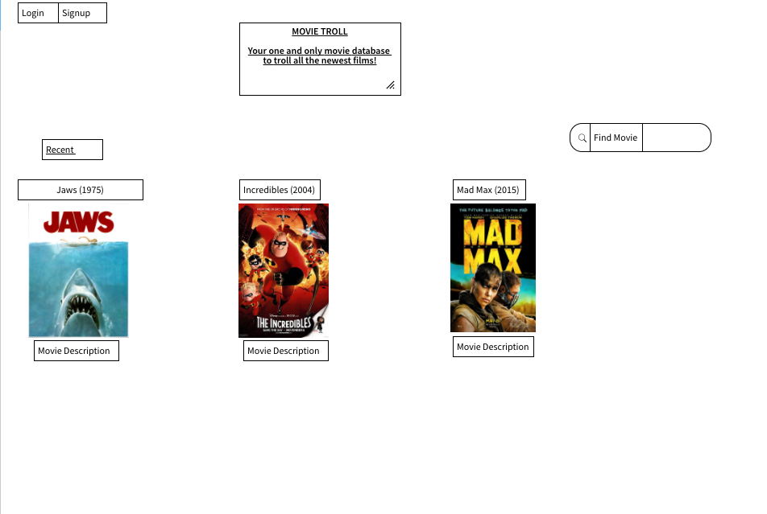
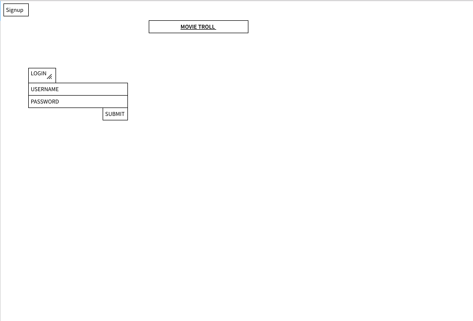
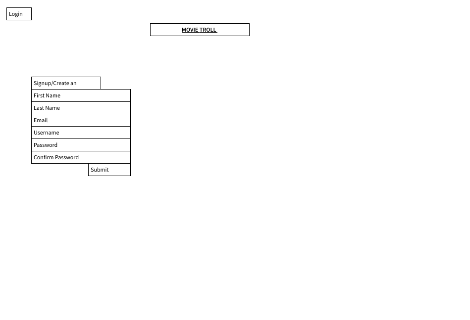
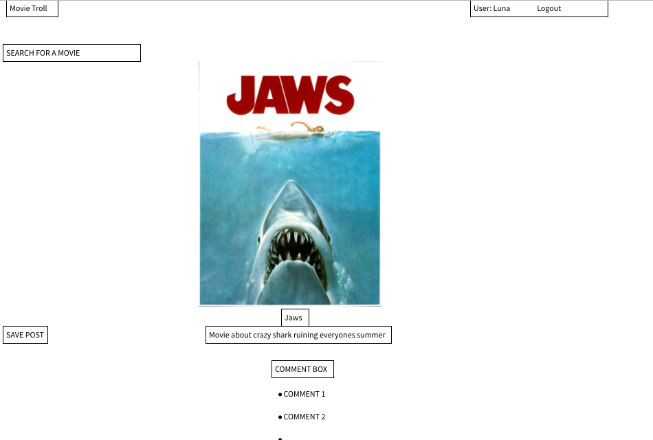
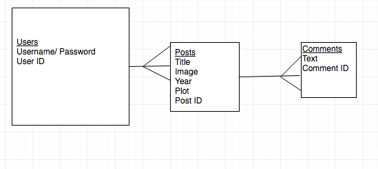

# Movie Troll
Movie Troll is a movie discussion site where, pretending the internet was void of negative comments, people could come to talk trash about anything movie related.  Using The Movie Database API, a user will search for the movie they want to discuss and post the movie poster and plot for all to see.  Below in the comments for each posting all users can talk about anything they want regarding that movie.

Here is the link to our [app](https://movie-troll.herokuapp.com/)

--

# Technologies Used

This app was made out of HTML, Node.js, Express, AJAX, Bootstrap, CSS and Google Fonts.

--

# General Approach

Our approach was to start with the user login and build out from there. Our first step was to create the signup/login function. After that, we linked our API to the app, and created a search bar so that users could use it to find movies by their name. From the API, users can pull down the movies name, a poster image, and a synopsis. From there, we added in the comment section, which allows people to post comments to each movie page. Once these were established and working, we added to it the ability to edit & delete comments, as well as a way remove movies from the page and edit the movie's synopsis. After that, we added the ability to login through Facebook, and then we styled it to a beautiful finish.  

For a more detailed view of our work, here is our [Trello](https://trello.com/b/oqc04sL4/project-3) Board.

# Division of Tasks

Brad: Our brave Project Manager and Fearless Leader, created the routes for the functions used.

Michael: Styled our website to make it extremely visually appealing. He also played a huge factor in creating the comment section.

Dylan: The eyes and ears of the team, managed the Trello board, pitch deck,  ERD, and wireframe. Also helped with some styling and minimal routing.

Mark: The Heroku master, would make sure we were comfortably deployed after each big step in our project. Also linked users to Facebook and helped with the routes.

--
# Unsolved Problems
The biggest hurdles we had to overcome were importing new technology onto the app. In particular, adding the ability to login to Facebook proved to be difficult, and took a considerable amount of time to get working flawlessly. In addition, we had some struggles with editing, updating and deleting comments that took some time to overcome.

--

# Wireframe

## Opening Page

## Login Page

## Sign In Page

## Movie Comment Page

--

# ERD

--
# Presentation Deck

Here is [Our Presentation Deck](https://docs.google.com/presentation/d/1Tfh6G-9Ok3UlWdybOubuuV462EEH5mSoIUPAnGZ25zc/edit?ts=597120d1#slide=id.p)

--
# Installation Instructions

To install this app you must run:

git clone

npm install

mongod (on another window of the terminal)

nodemon

And then visit localhost 3000

# Technologies Used
 This app was built using Node, Express, and MongoDB.  We also used The Movie Database API for the movie information.  For user verification we used Passport, particularly Passport local strategy.  
 Mockups were done in Balsamic and we versioned with Git and GitHub.

# App Screenshot

